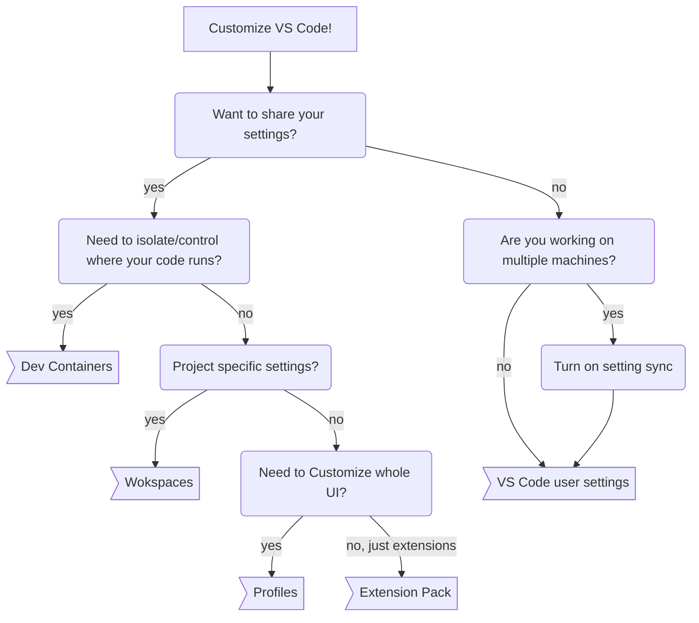

My brain needs to be comfortable when I work or I can end up being distracted and grumpy 😅 Customizing my spilt ergo keyboard, PC lighting, terminals, and editors usually meets this need. However, the more options or features for a tool, the more I can get sucked into the endless vortex of settings in trying to achieve what I want.

_What can I customize about VS Code in the first place?_
- [Editor settings](https://code.visualstudio.com/docs/getstarted/settings#_settings-editor) like (but not limited to):
  - Themes + fonts
  - integrated git settings
  - Run and debug tasks, etc.
  - Keybindings
  - Code snippets
- [UI state](https://code.visualstudio.com/docs/editor/profiles#_profile-contents): what windows/panes are visible and where, what files are open, etc. 
- Installed [extensions](https://code.visualstudio.com/docs/editor/extension-marketplace) and extension specific settings
- Where my code gets run (if I am working with [Dev Containers](https://code.visualstudio.com/docs/devcontainers/containers)/Docker)

I want to cover in this post how to choose how and when to use the different customization tools in VS Code. I'll try and group the features by whether its something I would use mainly personally or to share with others (though some fall in-between). At the end I'll mention how these different features interact and give a couple of common examples I run across and how I manage customizing them 👍

> Disclaimer: These are not at all hard "rules" just some rough logic that I use to decide where I need to specify a customization.
> Also I do a lot of demos and tutorials so I need to keep things extra compartmentalized, which may be overkill for others 😄

## Personal settings

### User settings

This is probably the most common way that folks are familiar with [settings in VS Code](https://code.visualstudio.com/docs/getstarted/settings), you can access your user settings and VS Code default settings by using the command pallet `Preferences: Open User Settings`. This gives you a nice UI view of your settings with a search bar at the top with some nice filtering options via the icon in the right of the search bar. You can also see a row of tabs along the top of the window just under the search bar that gives you a nice way to see the settings it knows about broken down by scope (user/default/workspace/dev container).

If you prefer to look at the settings files yourself, you can also use `Preferences: Open User Settings (JSON)` to edit the file directly. VS Code knows that it's a setting file so it will help with autocomplete for keys and values in the file.

### Settings Sync

If you work on more than one machine, [Settings Sync](https://code.visualstudio.com/docs/editor/settings-sync) can help keep your VS Code experience the same no matter where you are working. It uses a GitHub or Microsoft login to connect VS Code to your synced profile, and has a lot of nice tools to manage what machines/settings are kept in sync as well as versioning and conflict resolution tools.

Often settings can involve specifying paths, keybinds, and other things that are machine specific, so [you can configure](https://code.visualstudio.com/docs/editor/settings-sync#_configuring-synced-data) if they get synced (they are not synced by default).

> **When to use:** Settings Sync also syncs [profiles](#profiles) so my strategy is to move any settings I want to sync to profiles, and turn setting sync on.

### GitHub Codespaces dotfiles

[GitHub Codespaces dotfiles](https://docs.github.com/en/codespaces/customizing-your-codespace/personalizing-github-codespaces-for-your-account#dotfiles) aren't exactly a VS Code specific feature, but it interacts with how you might use VS Code in [Codespaces](https://github.com/features/codespaces). It basically allows you to setup all of your creature comforts/dotfiles that you would have on your local machine, but pre-added to any Codespace you start up.

I think the scope of what you can set with the dotfiles (a lot of scripting) is generally much more than just editor settings. They have more control over how your code is run, and thus is more similar to [Dev Containers](#dev-containers). Unlike containers, these dotfiles are not really shareable and are really more aimed at single-user scenarios.

## Project settings

### Workspaces

In general, VS Code assumes you have a single folder (a "workspace") you are opening to work from, but with larger projects that may not be true.
[Workspaces](https://code.visualstudio.com/docs/editor/workspaces) in VS Code are geared towards workflows that are comprised of multiple projects/directories, and let you specify any VS Code setting you could normally.
Here is a [good article](https://code.visualstudio.com/docs/getstarted/settings#_workspace-settings) on how to configure Workspaces.

### Dev Containers

My favorite customization option (and something I setup for nearly every project) are [Dev Containers](https://containers.dev). Dev Containers are not specifically a VS Code feature, it is an open specification that tools like VS Code, Jetbrains, Codespaces, DevPod, and others use to help make it easy to configure an entire development _experience_. It does this by combining a Docker/Docker Compose container specification with a json settings file to configure settings/extensions in the editor you are using with the container (if the editor supports the specific setting from Dev Containers.)

One common situation that Dev Containers help with is when you need to make sure that you can reproduce how the code runs as well as what the editor looks like, for example during a workshop or tutorial. You can be confident that you will not hear "It's not working on my machine" from your peers, students, or contributors because you have fully specified a reproducible, containerized environment as well as an editor config.

For more on Dev Containers, see the [VS Code docs](https://code.visualstudio.com/docs/devcontainers/containers) and my [PyCascades 2023 talk]().

## Hybrid: personal and project

### [Profiles](https://code.visualstudio.com/docs/editor/profiles)

See my [earlier blog post]() to learn more about how I use profiles 😄

### [Extension Packs](https://code.visualstudio.com/api/references/extension-manifest#extension-packs)
https://code.visualstudio.com/blogs/2017/03/07/extension-pack-roundup

## How do the different Customization features interact?

https://code.visualstudio.com/docs/getstarted/settings#_settings-precedence

## Real life examples

- Running a tutorial
- Pair programming
- Demos
- Focusing on writing a blog :)